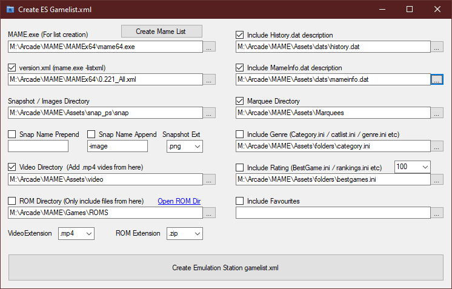

# CreateGameListFromMameXML
Create Emulation Station gamelist.xml from MAME -listxml .xml

Uses .net framework 4

There are probably easier ways of doing this, but this is mine.

I wrote this to easily update my Emulation Station game list.

## Requirements:

* A MAME executable. Preferrably already set up, and ready to use.

* A set of screenshots. If you don't have any, I recommend AntoPISA's snapshots: http://www.progettosnaps.net/snapshots/

## Optional:

* A set of videos. Again, AntoPISA has an excellent set. http://www.progettosnaps.net/videosnaps/

* MAME rom files. In compressed, split or merged format. You can't run the emulator without them! (Well, you can, but that's for another day)

* A MAME History.dat file. E.G. the one at Arcade History https://www.arcade-history.com/

* A MAME Info.dat file. E.G. the one at MASH's https://mameinfo.mameworld.info/

* A set of Marquee pictures. Again, AntoPISA has a great set. http://www.progettosnaps.net/marquees/

* A MAME folders.ini format category.ini file. E.G. AntoPISA, the CatVer32 ini, http://www.progettosnaps.net/catver/, the category.ini from http://www.progettosnaps.net/renameset/ or MameUI Category.ini from http://mameui.info/

* A rating folders.ini, eg the BestGames.ini from AntoPISA http://www.progettosnaps.net/bestgames/

* Your own folder.ini file with a list of favourite games in it. (Again, in the mameui folders.ini format.)

## To Use:

* Set the path to the mame.exe file, give the version.xml file a name, and click [Create Mame List]. Give it a little while. When it's done, it will save the new .xml file.

* Set the screenshots directory.

* Optionally set all the other files/folders.

* Click [Create Emulation Station gamelist.xml]. And wait. A progress bar will display it's current progress.

## Notes:

.Net seems to require a large amount of ram to load the mame.xml file. 

About 2.5GB on my PC, for the mame 0.220 .xml.

It takes about 10-12 mins to finish creating a full gamelist.xml with all options on. (On my own PC)
